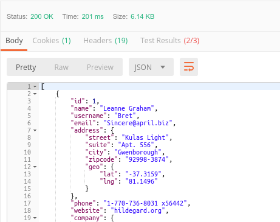
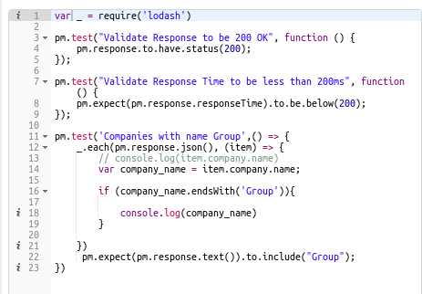
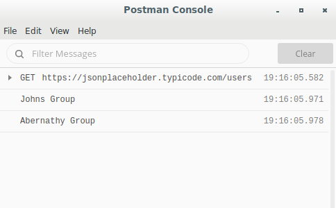
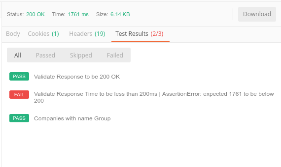

### What this project is for?

This project does a GET request to the following API endpoint
https://jsonplaceholder.typicode.com/users

The postman collection tests does the following:

-   Validates the response code to be 200.
-   Validates the response time to be less than 200ms.
-   Iterates over all elements of the json response body and print out all company names ending in “ Group”.

### How to run the project

1. Open Postman Desktop App
2. Import the JSONPlaceholder Resources.postman_collection.json in folder postman-collections
3. Invoke the endpoint
4. View the tests

### Screenshots

|        Postman Response         |        Postman Tests         |            Postman Console Output             |
| :-----------------------------: | :--------------------------: | :-------------------------------------------: |
|  |  |  |

### Test Results

